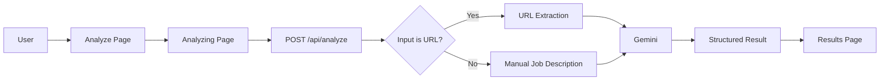

# Architecture

## System Flow

## Frontend

- `Analyze.tsx` owns file selection, mode selection, input validation, base64 conversion, and the initial session-storage handoff.
- `Analyzing.tsx` performs the POST request, shows progress state, handles errors and timeout aborts, and navigates on success.
- `Results.tsx` reads the stored `AnalysisResult` and renders the existing report UI.
- React Router defines `/analyze`, `/analyzing`, and `/results`.

## Backend

- `server/index.ts` creates the Express app and registers `POST /api/analyze`.
- `server/routes/analyze.ts` validates the request, resolves URL input when needed, calls Gemini, validates structured JSON, and returns the result.
- `shared/api.ts` defines the shared `AnalysisResult` contract.

## Data Handoff

The browser sends JSON containing `imageBase64`, `mediaType`, and `jobDescription`. The existing endpoint contract is unchanged for both manual text and URL input.
